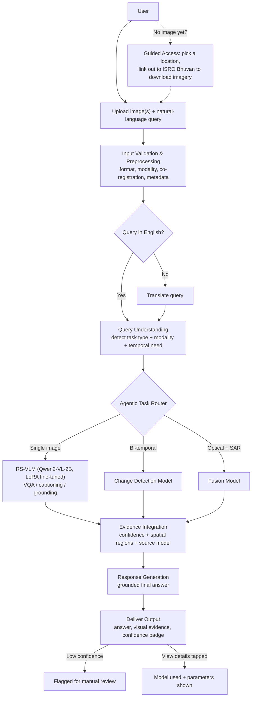

# SAT-GPT

A natural-language assistant for satellite image analysis — ask a question about an optical, SAR, or bi-temporal satellite image and get a grounded, evidence-backed answer, without needing GIS training or knowing which model to use.

Built for Smart India Hackathon 2026, Problem Statement 26167 (ISRO / Space Applications Centre).

---

## The Problem

Two documented, independent findings motivate this project:

1. **Satellite data being available doesn't mean it's usable.** A 2025 Georgia Tech case study, [*Challenges in using satellite data for non-remote-sensing specialists*](https://www.cambridge.org/core/journals/data-and-policy/article/challenges-in-using-satellite-data-for-nonremote-sensing-specialists-an-exploratory-case-study/D65CFBF5A4B76F1B625D225A6B896C3E) (Gaddipati et al., *Data & Policy*), followed a team with real institutional resources trying to use open satellite data for a research question. They still struggled at every stage — knowing what product existed, choosing the right tool, and interpreting results that changed depending on which version of the data they used.

2. **India's own geospatial ecosystem has the same gap.** The Takshashila Institution's [*State of India's Geospatial Portals*](https://takshashila.org.in/content/publications/20251024-State-of-Indian-geospatial-portals.html) (Oct 2025) reports that Indian portals — Bhuvan included — are limited by fragmentation across agencies, technical complexity, and a shortage of skilled interpreters, even though the underlying data is often already public.

SAT-GPT doesn't try to replace ISRO's data infrastructure. It adds a natural-language analysis layer on top of it — the user states intent, the system handles data validation, model selection, and execution.

---

## Why This Architecture

**Why an agent, not just a VLM.** [RS-Agent](https://arxiv.org/abs/2406.07089) (Xu et al., 2024) shows that a single multimodal model isn't enough for realistic remote-sensing workflows — queries are often under-specified. "Assess the damage" implicitly requires change detection *and* area estimation *and* severity judgment, not one text response. That's why SAT-GPT routes each query through a classification step before any model runs, rather than handing every query straight to one model.

**Why validation runs before analysis, not after.** [*Agentic AI for Remote Sensing: Technical Challenges and Research Directions*](https://arxiv.org/abs/2604.24919) (Munir et al., 2026) argues Earth observation isn't a generic agentic-AI problem: operations like reprojection, resampling, and temporal alignment actively transform the data's state, and an early mistake — wrong CRS, mismatched resolution, a modality the query didn't ask for — can propagate silently through the rest of the pipeline without ever producing an obviously wrong-looking output. This is the direct justification for SAT-GPT's input validation stage running before any specialist model is invoked, not as an afterthought.

**Why specialist tools instead of one model doing everything.** [*Advancements in Vision–Language Models for Remote Sensing*](https://doi.org/10.3390/rs17010162) (Tao et al., 2025, CC BY) makes the case that VLMs handle open-ended question-answering well but that dense outputs — segmentation, precise change masks — are still better served by dedicated model heads. SAT-GPT reflects this directly: one fine-tuned VLM for conversational tasks, separate specialist models for change detection and optical-SAR fusion.

**Why LoRA.** The same survey identifies LoRA as the standard efficient fine-tuning approach for adapting a pretrained VLM to a new domain without full retraining — the only realistic option given the compute available for this project.

---

## Architecture

The dashed translation path only runs for non-English queries. Confidence-based escalation and the "view details" expansion both live inside the final output stage — there's no separate audit-report screen, since this system is built for one user, not a dual expert/non-expert interface.

---

## Validation Checklist

Before any specialist model runs, the controller checks:

- image count and pairing (single / bi-temporal / optical+SAR)
- modality (optical vs. SAR vs. both)
- co-registration (do paired images actually cover the same area?)
- acquisition date and temporal gap, for change queries
- CRS, resolution, and dimensions from GeoTIFF metadata

This list is directly informed by the failure modes catalogued in Munir et al. (2026) — modality mismatch, resolution mismatch, missing metadata, and CRS misalignment are named there as the specific ways EO pipelines fail silently. Catching them here is the reason SAT-GPT doesn't just hand every upload straight to the model.

---

## Datasets

Six datasets, unified into one schema (132,866 samples total) via `satquery_dataset.py`:

| Dataset | Role | Status |
|---|---|---|
| VRSBench | Captioning, VQA, grounding | 62,918 samples, working |
| RSVQAxBEN | VQA on BigEarthNet imagery | Working |
| RSVQA-LR | VQA | Working |
| BigEarthNet | Domain adaptation | 7,400 captions generated from real CORINE labels |
| QXS-SAROPT | Optical–SAR fusion pairs | 20,000 QA pairs, weak-labeled via color/texture heuristics |
| LEVIR-CD | Bi-temporal change detection | 2,548 QA pairs generated from building-change masks |

**Known deviation:** the problem statement references CDVQA for change-detection evaluation. The dataset it's built on (SECOND) is currently offline, so LEVIR-CD was substituted, with QA pairs generated directly from its change masks. This is a deliberate, documented substitution, not an oversight.

**Known limitation:** the BigEarthNet captions and QXS-SAROPT QA pairs are automatically or heuristically generated, not expert-verified. Tao et al. (2025) explicitly note that auto-generated RS annotations can contain errors — these two sources should be read as weak supervision, useful for training but not a claim of ground-truth quality.

---

## Model

- **Base model:** Qwen2-VL-2B-Instruct, adapted via LoRA (`finetune_vlm.py`)
- GeoChat and GeoGround were evaluated and kept as optional future additions — not swapped in for the current build
- Fine-tuning follows the standard frozen-base + trainable low-rank adapter pattern, rather than full retraining

---

## Unique Features

- **Regional language support** — non-English queries pass through translation before reaching the model
- **Confidence-based escalation** — low-confidence answers are flagged for manual review instead of returned silently
- **Adaptive detail toggle** — a simple answer by default; tapping through reveals which model ran and what parameters it used
- **Guided access for non-experts** — users without imagery are pointed to ISRO's own Bhuvan portal to find and download it, then upload it in normally. SAT-GPT never fetches imagery on its own behalf — everything stays upload-only

---

## What's Actually Implemented

| Component | Status |
|---|---|
| `satquery_dataset.py` — unified 6-dataset loader | Built, tested locally |
| `agentic_controller.py` — task router, validation, tool registry, JSON audit trail | Built, tested against 6 cases including edge-case rejection |
| `finetune_vlm.py` — LoRA fine-tuning for Qwen2-VL-2B | Script complete; training run in progress |
| `region_detection.py` — building/water/forest heuristic detector | Placeholder, pending trained grounding model |
| `threejs_viewer.py` — 3D extrusion of detected regions | Built |
| `app.py` — Streamlit app (upload → controller → view) | Built |

Not yet final: trained model weights with a before/after comparison, a production grounding model, calibrated (rather than heuristic) confidence scoring, and full benchmark evaluation. The architecture and data pipeline are complete; the trained components are the remaining work.

---

## Tech Stack

Python · PyTorch · Transformers · Streamlit (frontend and backend, no separate API layer) · Colab (GPU training) · SQLite (query logging)

---

## Research & Citations

1. Munir, M. A. et al. *Agentic AI for Remote Sensing: Technical Challenges and Research Directions.* arXiv:2604.24919, 2026. https://arxiv.org/abs/2604.24919
2. Xu, W. et al. *RS-Agent: Automating Remote Sensing Tasks through Intelligent Agent.* arXiv:2406.07089, 2024. https://arxiv.org/abs/2406.07089
3. Tao, L., Zhang, H., Jing, H., Liu, Y., Yan, D., Wei, G., Xue, X. *Advancements in Vision–Language Models for Remote Sensing: Datasets, Capabilities, and Enhancement Techniques.* Remote Sensing, 2025, 17, 162. https://doi.org/10.3390/rs17010162 (CC BY 4.0)
4. Gaddipati, H. et al. *Challenges in using satellite data for non-remote-sensing specialists, an exploratory case study.* Data & Policy, 2025. https://www.cambridge.org/core/journals/data-and-policy/article/challenges-in-using-satellite-data-for-nonremote-sensing-specialists-an-exploratory-case-study/D65CFBF5A4B76F1B625D225A6B896C3E
5. Takshashila Institution. *State of India's Geospatial Portals.* October 2025. https://takshashila.org.in/content/publications/20251024-State-of-Indian-geospatial-portals.html

Sources 3 and 4 are confirmed open access (CC BY) and their findings are paraphrased above rather than reproduced verbatim. Sources 1, 2, and 5 have no confirmed open license, so they are cited and linked rather than having their figures reproduced here — the architecture diagram above is original to this project.
